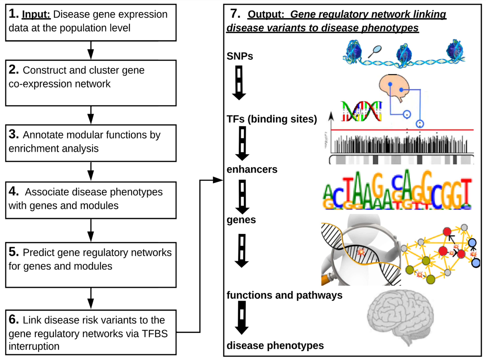

# Introduction {#intro}


Summary
-------

Genome-wide association studies (GWAS) have found many genetic risk variants associated with Alzheimer’s disease (AD). However, how these risk variants affect deeper phenotypes such as disease progression and immune response remains elusive. Also, our understanding of cellular and molecular mechanisms from disease risk variants to various disease phenotypes is still limited. To address these problems, we developed a computational pipeline of integrated multi-omics analysis from genotype, transcriptomics, epigenomics to phenotypes for revealing gene regulatory
mechanisms from disease variants to phenotypes.

Method
------

This pipeline, ADSNPheno, aims to predict gene regulatory networks of AD risk Single-Nucleotide Polymorphisms (SNPs) to different AD phenotypes. In particular, ADSNPheno first clusters gene co-expression networks and identifies the gene modules for various AD phenotypes. ADSNPheno further predicts the transcription factors (TFs) that significantly regulate the genes in each module, as well as the AD SNPs interrupting the TF binding sites (TFBS) on the regulatory elements. Finally, ADSNPheno constructs a full gene regulatory network linking SNPs, interrupted TFs, and regulatory elements to target genes for each phenotype. This network thus provides mechanistic insights of gene regulation from disease risk variants to AD phenotypes.


Please note our pipeline, ADSNPheno:

<p align="center">
  
</p>

Please note that we will go over each of these steps of ADSNPheno in the respective chapters of this book. Step 0 is not shown in the pipeline, but it is general setting up of the pipeline and defaults. 

Our application will be the Hippocampus Ca1 gene expression dataset for better understanding molecular mechanisms involved in Alzheimer's disease progression.

ADSNPheno Table of Step Contents
------

Please note these steps in ADSNPheno:

| Step # | Step Name | Chapter in ADSNPheno Book | Description |
|------|------|------|------|
|0|Setup and Defaults|3|------|
|1|Disease gene expression data at the population level|4|------|
|2|Please construct and cluster a gene co-expression network |5|------|
|3|Please annotate modular functions by enrichment analysis |6|------|
|4|Please associate disease phenotypes with genes and gene co-expression modules|7|------|
|5|Please predict gene regulatory networks for genes and gene co-expression modules|8|------|
|6|Please link disease risk variants (like SNPs) to the gene regulatory networks via TF Binding Site interruption |9|------|
|7|Please output: Gene regulatory network linking disease variants to disease phenotypes |10| SNPs in or near regulatory regions like TF Binding Sites (in promoters and enhancers) for Target Gene (TG) $\Rightarrow$ TFs unable to bind to TFBS $\Rightarrow$ TFs unable to regulate TG $\Rightarrow$ dysregulation of TG (that belongs to a gene co-expression module) impacts various functions and pathways and is associated with various disease phenotypes  |


<!-- * Step 0: Setup and Defaults \@ref("Step 0: Setup and Defaults") -->
<!-- * Step 1: Setup and Defaults \@ref("Step 0: Setup and Defaults") -->
<!-- * Step 2: Setup and Defaults \@ref("Step 0: Setup and Defaults") -->
<!-- * Step 3: Setup and Defaults \@ref("Step 0: Setup and Defaults") -->
<!-- * Step 4: Setup and Defaults \@ref("Step 0: Setup and Defaults") -->
<!-- * Step 5: Setup and Defaults \@ref("Step 0: Setup and Defaults") -->
<!-- * Step 6: Setup and Defaults \@ref("Step 0: Setup and Defaults") -->
<!-- * Step 7: Setup and Defaults \@ref("Step 0: Setup and Defaults") -->


Step 0: Please setup the appropriate workspace environment
------

You can label chapter and section titles using `{#label}` after them, e.g., we can reference Chapter \@ref(intro). If you do not manually label them, there will be automatic labels anyway, e.g., Chapter \@ref(methods).

Figures and tables with captions will be placed in `figure` and `table` environments, respectively.

```{r nice-fig, fig.cap='Here is a nice figure!', out.width='80%', fig.asp=.75, fig.align='center'}
par(mar = c(4, 4, .1, .1))
plot(pressure, type = 'b', pch = 19)
```

Reference a figure by its code chunk label with the `fig:` prefix, e.g., see Figure \@ref(fig:nice-fig). Similarly, you can reference tables generated from `knitr::kable()`, e.g., see Table \@ref(tab:nice-tab).

```{r nice-tab, tidy=FALSE}
knitr::kable(
  head(iris, 20), caption = 'Here is a nice table!',
  booktabs = TRUE
)
```

You can write citations, too. For example, we are using the **bookdown** package [@R-bookdown] in this sample book, which was built on top of R Markdown and **knitr** [@xie2015].
